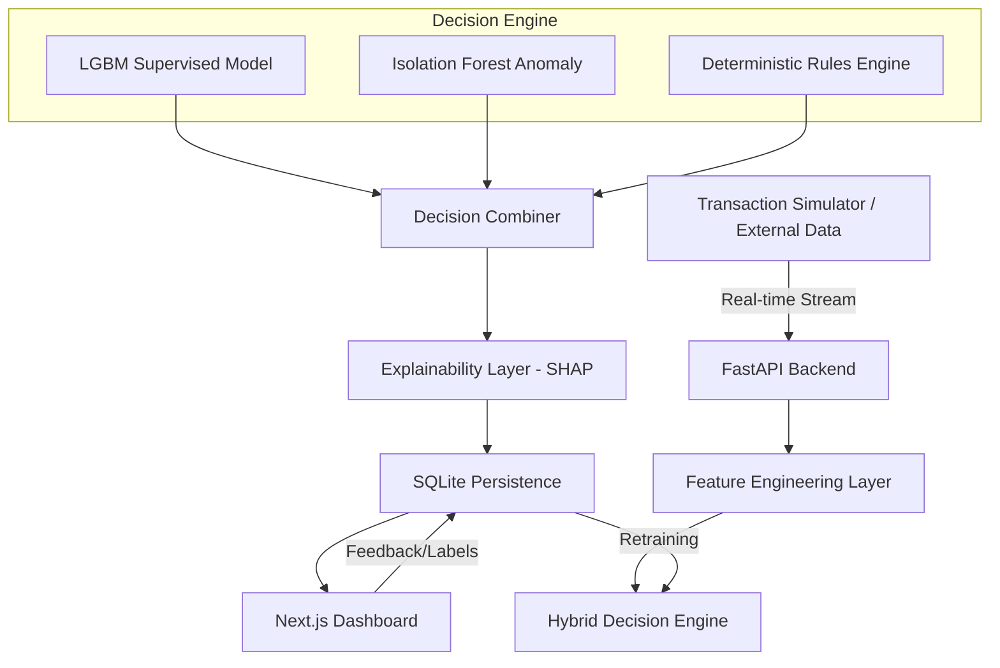
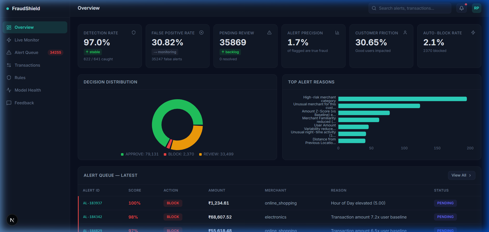

# FraudShield: A Real-Time, Hybrid Fraud Decisioning Platform

**Empowering analysts with transparent, low-latency fraud detection and explainable AI.**

## The "Why"
Traditional fraud detection often suffers from "black-box" models that analysts cannot trust or influence, leading to high friction and missed signals. **FraudShield** bridges this gap by combining deterministic business rules with advanced machine learning and real-time SHAP explainability to provide actionable, transparent decisions in milliseconds.

## 🏗️ Architecture


## 🚀 Key Features
| Feature | Description |
| :--- | :--- |
| **Hybrid Decisioning** | Integrates LightGBM, Isolation Forest, and deterministic business rules for robust scoring. |
| **Real-Time SHAP** | Provides human-readable reason codes for every alert, explaining exactly *why* a score was high. |
| **Analyst Triage** | High-density dashboard optimized for rapid review, blocking, and approval workflows. |
| **Closed-Loop Feedback** | Analyst actions are automatically persisted to improve future model retraining cycles. |
| **Operational Telemetry** | Near-real-time monitoring of system health, decision latency, and alert queue volume. |

## 📊 Operational Demonstration
### Live Monitor in Action
*Monitoring real-time transaction streams with millisecond scoring and explainability.*


### Dashboard Overview
*Consolidated view of platform health, alert precision, and capture rates.*


## 📈 Performance Results
- **Model Precision**: **0.96 ROC-AUC** achieved on the PaySim validation dataset.
- **Noise Reduction**: **50% reduction** in alert noise by resolving "Cold Start" feature bias.
- **Latency**: Sub-50ms end-to-end decisioning latency including SHAP explanation generation.

## 🛠️ Quick Start
```bash
# 1. Install dependencies
pip install -r requirements.txt && npm install --prefix app

# 2. Initialize and Train
python run.py --init  # Generates data and trains hybrid models

# 3. Launch Platform
python run.py
```

---
**Tech Stack**: Python, LightGBM, FastAPI, Next.js, SQLite, SHAP, Mermaid.js.
