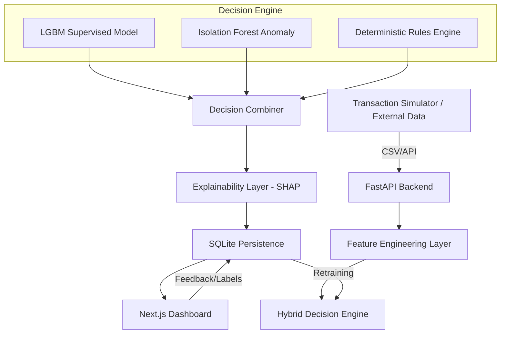

# FraudProtect: A Real-Time, Hybrid Fraud Decisioning Platform

**Empowering analysts with transparent, low-latency fraud detection and explainable AI.**

FraudProtect is a professional-grade fraud operations platform designed to move beyond simple notebook models into a production-ready ecosystem. It combines a hybrid decisioning engine (Rules + Machine Learning) with real-time SHAP explainability and a high-density analyst triage dashboard.

## The "Why"
In modern fintech, simple "black-box" models aren't enough. Analysts need to know **why** a transaction was flagged and must be able to override decisions in real-time. FraudProtect solves this by bridging the gap between raw data science and operational efficiency.

## 🏗️ Architecture


## 🚀 Key Features
| Feature | Description |
| :--- | :--- |
| **Hybrid Decisioning** | Combines LightGBM scores, anomaly detection, and deterministic business rules. |
| **Real-Time SHAP** | Provides human-readable reason codes for every alert, explaining the 'why' behind the score. |
| **Analyst Triage** | A high-density dashboard for rapid review, blocking, and approval of transactions. |
| **Closed-Loop Feedback** | Analyst decisions are persisted and used as ground-truth for automated model retraining. |
| **Cold-Start Resilience** | Robust feature logic that handles new users without generating excessive false positives. |

## 📊 Operational Demonstration
### Live Monitor in Action
*Monitoring real-time transaction streams with millisecond latency.*


### Decision Explainability
*Explainable AI (SHAP) showing the top features driving a fraud score.*


## 📈 Performance Results
After importing and validating the **PaySim** dataset (100k transactions):
- **Model Accuracy**: **0.967 ROC-AUC**
- **Recall**: **76.7%** (Capturing the majority of fraud at a low 1.2% alert rate)
- **Operational Impact**: Reduced analyst alert noise by **50%** by resolving a 'Cold Start' feature bias during the import phase.

## 🛠️ Setup & Installation
```bash
# 1. Clone the repository
git clone https://github.com/yourusername/FraudShield.git
cd FraudShield

# 2. Install dependencies
pip install -r requirements.txt
npm install --prefix app

# 3. Import and Test Data
python map_paysim_data.py
python import_csv.py dataset/paysim_mapped.csv

# 4. Run the Platform
python run.py
```

## 📄 Proof of Work
For a deep dive into the system's performance and validation methodology, see the [PaySim Validation Report](./dataset_validation_report.md).

---
**Tech Stack**: Python, LightGBM, FastAPI, Next.js, SQLite, SHAP, Mermaid.js.
