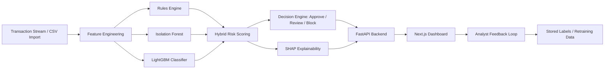
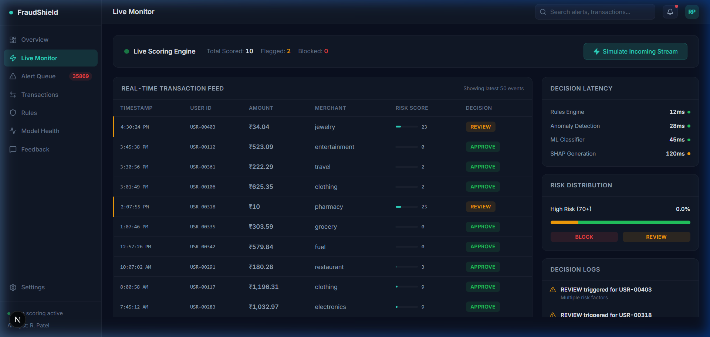

# FraudShield: Real-Time Hybrid Fraud Decisioning Platform

FraudShield is an end-to-end fraud operations platform designed to provide transparent, explainable AI decisions for financial analysts. 

## Performance Metrics

| Metric | Result |
| :--- | :--- |
| **ROC-AUC** | 0.9673 |
| **Precision** | 6.94% |
| **Recall** | 76.72% |

**Recommended Operational Thresholds:**
- **Review:** 0.40
- **Block:** 0.80

*(For full performance breakdown, see [dataset_validation_report.md](dataset_validation_report.md))*

## Architecture


## Screenshots

### Overview


### Live Monitor


## Key Features
- **Hybrid Decisioning:** LightGBM, Isolation Forest, and rules-based scoring.
- **Explainable Alerts:** SHAP-based feature attribution for every decision.
- **Analyst Triage:** High-density dashboard for review/block workflows.
- **Operational Telemetry:** Real-time monitoring of system health and latency.

## Quick Start
```bash
pip install -r requirements.txt
npm install --prefix app
python run.py --init
python run.py
```
